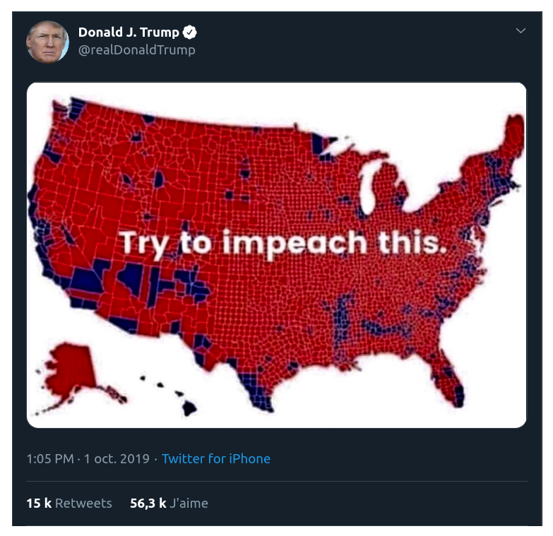

class: inverse, center, middle

# Cartographie

### Le programme

```{r setup, include=FALSE}
  library(knitr)

# knitr::opts_chunk$set(fig.path="c://Users/jmigozzi/Dropbox/ENS/Cours/FormationR/MappingwithR/img/")
# setwd("C:/Users/jmigozzi/Dropbox/ENS/Cours/FormationR/MappingwithR/")
# options(htmltools.dir.version = FALSE)
# knitr::opts_chunk$set(fig.retina=2)
#knitr::opts_chunk$set(cache = F)
# 

# library(Cairo)
# library(cairoDevice)
# load("my_work_space.RData")
library(tidyverse)
library(kableExtra)
library(sf)
library(spData)
library(tmap)
library(cartography)
library(viridis)
library(ggthemes)
library(hrbrthemes)
library(tmap)


```


---
### Trois objectifs


- Ouvrir, manipuler et explorer des données spatiales avec R ;

<br><br>

- Acquérir les méthodes et normes de la cartographie ; 

<br><br>

- Gagner en autonomie pour le traitement de données spatiales.

---
### 3 séances


Séance 1 - 21/01. L'information géographique : données et outils

  - *Données spatiales avec R : format, manipulation*

<br><br>

Séance 2 - 28/01. Cartographie : sémiologie graphique

  - *Construire des cartes avec R*
  
<br><br>

Séance 3 - 05/02. Données spatiales et statistiques

  - *Cartographier une régression linéaire*
  - *Autocorrélation spatiale*
  

---
### Logistique

<br><br>

- Un espace a été ouvert sur Slack : qess-carto.slack.com

<br><br>

- Les slides du cours seront disponibles sur Git-Hub (lien posté dans Slack)

<br><br>

- Validation (?)


---
class: inverse, center, middle

# L'information géographique

### Données et outils

---
### Une abondance de données territoriales

- Mouvement des organismes publics vers l'Open Data : voir le rapport "Mission Politique Publique de la Donnée", octobre 2020.

- Exemple : "[les données carroyées de l'INSEE](https://www.insee.fr/fr/information/5008701?sommaire=5008710)" ou la base de données SIRENE

```{r, eval = T, echo = F, fig.align="center", out.width= "50%"}


```
.center[.tiny[Part des ménages pauvres à Marseille. Source : [Geoportail.](https://www.geoportail.gouv.fr/carte)]]


---
### Une abondance de données picturales (format raster)

- des images satellites ; 
- des orthophotos, comme celle de l'[IGN](https://geoservices.ign.fr/blog/2020/09/08/Grand_angle_diffusion_ortho.html) ; 
- des cartes d'occupation des sols, par exemple pour l' [UE](https://www.statistiques.developpement-durable.gouv.fr/corine-land-cover-0) ou les [Etats-Unis](https://www.mrlc.gov/) ; 

<br>

.pull-left[
- Exemple : [Google Earth Engine](https://earthengine.google.com/) et le package [rgee](https://github.com/r-spatial/rgee) :

    - température 
    - précipitation, surface en eaux ; 
    - données atmosphériques
    - modèles d'élévation de terrain
    - *etc.*
]

.pull-right[

```{r, eval = T, echo = F, fig.align="center", out.width= "100%"}

```
]

---
### Des données textuelles

- Articles de presse, débats parlementaires, textes législatifs...
- Analyser : 
  - comment les groupes sociaux qualifient les lieux ;
  - le rapport à l'environnement ; 
  - les effets de distance dans la circulation de l'information *etc*.

<br>

```{r, eval = T, echo = F, fig.align="center", out.width= "50%"}

```
.center[ .tiny[Source : [Projet ODYCCEUS](https://www.odycceus.eu/#content)]]


---
### De nouvelles sources de données numériques

- Réseaux sociaux : Facebook, Twitter, Instagram...
- Plateformes : Uber, LeBonCoin, Yelp, Google Maps...

- Exemple : 

```{r, eval = T, echo = F, fig.align="center", out.width= "50%"}

```
.center[.tiny[Boy & Uitermark (2017) Reassembling the city through Instagram. *Transactions of the Institute of British Geographers*.]]
  
---
### Conséquence : toujours plus de cartes

```{r, eval = T, echo = F, fig.align="center", out.width="70%", out.height= "80%"}

```
.center[.tiny[Source : N. Lambert, [Make our Cartography Great Again!](https://neocarto.hypotheses.org/6569)]]


---
### Conséquence : toujours plus de cartes fausses

```{r, eval = T, echo = F, fig.align="center", out.width="70%", out.height= "80%"}

```
.center[.tiny[Source : [Abley's Blog](https://www.abley.com/about-us/latest-news/cartography-fails-for-covid-maps/)]]


---
class: middle, inverse, center

# Cartographie et information géographique


---
### Cartographie et géographie


- Une discipline militaire et coloniale : cartographie et conquête
- La carte : un instrument de pouvoir

<br><br>

.blockquote[As much as guns and warships, maps have been the weapons of imperialism.
.right[Brian Harley, *Maps, Knowledge and Power*, 1988]]

---
## Cartographie et géographie quantitative

### Années 1960-1970 : révolution quantitative

--
- Essor de l'analyse spatiale : "*décrire, mesurer et expliquer les structures spatiales*" (FCC, 2019)
- Recherche de lois générales dans l'organisation de l'espace : modélisation.
- Essor de la _regional science_, de l'économétrie spatiale.

--

### Années 2010 : tournant "digital" de la géographie quantitative

- Nouveaux jeux de données par la numérisation des sociétés  
- Rencontre avec d'autres sciences : *Data Science*, CSS, 
- Importation de techniques : machine learning, network analysis
- Vers la "*Spatial Data science*" ou "*Geographical Data Science*" ?

.center[ => .tiny[Arribas-Bel, D, 2018. “[Geography and Computers: Past, Present, and Future](https://onlinelibrary.wiley.com/doi/abs/10.1111/gec3.12403)”, _Geography Compass_.]]

---
### Un écosystème spatial

```{r, eval = T, echo = F, fig.align="center", out.width="60%"}

```

---
### Des ressources


  - [Geocomputation with R](https://geocompr.robinlovelace.net/), de Lovelace, Nowosad et Muenchow
  - [R et Espace](https://framabook.org/r-et-espace/)
  - [Spatial Data Science](https://keen-swartz-3146c4.netlify.app/), de Edzer Pebesma et Roger Bivand
  - [Introduction to Spatial Data Programming with R](https://geobgu.xyz/r/), de Michael Dorman
  - [Data Visualization : A practical introduction](https://socviz.co/), de Kieran Healy

  
---
### L'information géographique

.blockquote[
Une information est dite géographique lorsqu'elle se rapporte à un ou plusieurs lieux de la surface terrestre. C'est une information localisée et repérée, ou encore "géocodée".
.right[Béguin & Pumain, 2010]]

<br>

Deux grands types de données : 
  - données dites géométriques : information spatiale (des formes localisées)
  - données non géométriques, que l'on doit relier aux autres (par exemple, un tableau INSEE)

---
### Les vecteurs : formes géométriques

Ce sont des représentations géométriques d'une entité géographique.

```{r, echo = F, fig.align="center", out.width="60%"}

include_graphics("img/points-lines-polygons-vector-data-types.png")

```

.center[[Source : Earth Lab](https://www.earthdatascience.org/courses/earth-analytics/spatial-data-r/intro-vector-data-r)]

---
### Les vecteurs : formes géométriques

- Données ponctuelles : individu d'une population (arbre, établissement, évènement, ville) ; mesure (température, humidité)

- Données linéaires : cours d'eau ; infrastructures de transports ; réseau viaire

- Données zonales : unités administratives (quartier, ville) ; aires naturelles (lac, forêt...)

---
### Les vecteurs : données attributaires

Les données attributaires se présentent sous forme de tableaux : 

  - chaque géométrie constitue une ligne : une entité ou un individu ; 
  - chaque attribut est une colonne : un champ ou une variable

```{r, echo = F, fig.align="center", out.width="50%"}

include_graphics("img/AttributeData.jpg")
```

.center[On retrouve le tableau élémentaire de la statistique]

---
### Les rasters

- Ce sont des objets matriciels, composés de cellules, dont la taille définit la résolution. 

- On divise le monde en cellules : chaque phénomène est enregistrée et mesurée dans chaque cellule. 

- Ce sont des images géoréférencées. 


```{r, echo = F, fig.align="center", out.width="80%"}


```

---
### Les formats des données spatiales

- Pour les vecteurs, on trouve souvent le format **shapefile** : 

  - développé par l'entreprise ESRI ; 
  - constitué au minimum des 3 fichiers suivants :  
  
      - *.shp* : contient les formes géométriques (points, lignes, polygones) ; 
      - *.shx* : stocke l'index de la géométrie
      - *.dbf* : contient les données attributaires (individus en ligne, variable en colonne)

- Mais on utilise aussi des formats KML, GeoJSON...

- Un format en vogue est le **GeoPackage** : 
    - format libre ; 
    - vecteurs et rasters.
  

---
### Les données non-géométriques

- Ce sont des tableaux qui ne comportent pas d'information spatiale, qu'il s'agit donc de retrouver en utilisant : = 
  - un code postal ; 
  - un nom de commune, de pays *etc*; 
  - une adresse postale ; 
  - des coordonnées XY ; 

- Données qui peuvent être : 

  - obtenues auprès d'institutions ; 
  - webscrapées et identifiées par du *Part Of Speech* tagging ; 
  - saisies par enquête de terrain. 


---
### Les données non-géométriques : géolocalisation

<br>

.center[.content-box-blue[Comment géolocaliser ses données ? ]]

<br>

- Première solution : réaliser une **jointure** entre le tableau et des données géométriques existantes.
  - Scénario : un shapefile récupéré auprès d'un collègue, téléchargé en ligne. 
  - Enjeu : avoir un identifiant commun.
  - Problème : quelle échelle d'agrégation ? 
  
- Deuxième solution : *géolocaliser* ses données 
  - Obtenir des coordonnées géographiques pour chaque individu de sa population
  - Enjeu : passer d'une adresse à un binôme X-Y.
  - Problème : ce sont souvent des services payants. 
  
---
### Les données non-géométriques : géolocalisation par API


- Préalable : données textuelles le plus précis possible (associer rue, code postal etc) dans un vecteur.

- Avec le package *tmaptools* et OSM :

```{r, eval = F}
a <- geocode_OSM(mydf$Adresse)
```

- Avec [Google](https://towardsdatascience.com/breaking-down-geocoding-in-r-a-complete-guide-1d0f8acd0d4b) :

```{r, eval = F}
library(ggmap)
# Obtenir une clé API puis l'enregistrer
gmAPIKey  <- "masupercléGoogle" 

register_google(key = api_key)

a <- geocode_OSM(mydf$Adresse, output = "more",
                 source = "google")
```

---
### Du nouveau !

- Le package [tidygeocoder](https://cran.r-project.org/web/packages/tidygeocoder/vignettes/tidygeocoder.html) :

```{r, eval = F}
results <- geocode(mydf, loc, method="osm", 
                   full_results=TRUE)
```

<br><br>

- le package [mixr](https://perso.ens-lyon.fr/lise.vaudor/geocodage-sous-r-via-une-api/) développé par Lise Vaudor :

<br><br>

.center[.content-box-red[Vérifier les coordonnées obtenues !]]

---
## Créer ses données sur QGIS

.center[Prise en main rapide de QGIS]

<br><br><br><br>

.center[.tiny[si on a le temps]]


---
class: inverse, center, middle

# Le package SF : *Simple Features*

```{r, echo = F, fig.align="center", out.width="80%"}

include_graphics("img/Sf_Horst.jpg")
```
.center[[Source : Allison Horst](https://github.com/allisonhorst/stats-illustrations)]

---

## Le format SF : Simple Features

- R dispose de packages qui permettent de lire, manipuler et visualiser des données spatiales.

- Le package `sf` s'impose comme le format de référence. 

- Il rend compatible les objets spatiaux avec la syntaxe du format `tidyverse`, qui permet de manipuler des tableaux.

- La [documentation en ligne](https://cran.r-project.org/web/packages/sf/index.html) est très fournie.

- De nombreux [tutoriels](https://github.com/riatelab/intro_sf) sont disponibles sur internet en français et anglais. 


---
## Lire un fichier spatial

- Avec le package SF, on utilise la fonction `st_read()`

- Celle-ci doit spécifier : 
  - le chemin pour trouver le fichier ; 
  - le nom du fichier et son format ; 
  - la projection utilisée (code epsg) ;
  - *stringsAsFactors = F*, pour éviter de transformer les variables textuelles en facteurs ; 


```{r, echo = T, eval=F}

idf_sf <- st_read(dsn = "", 
                  crs = , 
                  stringsAsFactors = F)
```


---

## Explorer un objet spatial

- La console indique déjà quelques informations :

```{r, echo = T, eval=T, include = T}
idf_sf <- st_read(dsn = "data/idf_data/parispc_com.shp", 
                  stringsAsFactors = F)
```


---

## Explorer un objet spatial 

```{r, echo = T, eval=T, fig.align="center"}
plot(idf_sf)
```
---

### Explorer un objet spatial 

```{r, echo = T, eval=T, fig.align="center"}
plot(idf_sf["NOM_DEPT"]) #choisir une colonne
```

---
### Explorer un objet spatial avec le package _mapview_

```{r, echo = T, eval=T, fig.align="center"}
library(mapview) # charger un package

mapview(idf_sf) # fonction mapview
```

---

### Explorer un objet spatial avec le package _mapview_

L'argument _zcol_ permet de visualiser une variable :

```{r, echo = T, eval=T, fig.align="center"}
 mapview(idf_sf, zcol = c("CODE_DEPT", "POPULATION"))
```

---
### Opérations attributaires


- Pour effectuer des opérations attributaires, on peut utilise les verbes du *tidyverse.* 


- Agrégation : géométries agrégées selon modalités des variables 


.left-code[
```{r plot-label1, eval=FALSE, warning=F, message = F}
dpt <- idf_sf %>% 
  group_by(NOM_DEPT) %>%
  summarise(POP = sum(POPULATION*1000)) 

plot(dpt)
```
]

.right-plot[
```{r plot-label1-out, ref.label="plot-label1", echo=FALSE, message = F, warning=F, out.width="100%", out.height="40%", fig.align="center"}
```
]


---
### Opérations attributaires

```{r}
head(dpt)
```


---
### Du tableau à l'objet sf

- Avec des coordonnées géographiques, on peut passer d'un tableau à un objet SF

```{r, eval = F}
library(sf)
r <- st_as_sf(mydf, 
              coords = c("longitude", "latitude"), 
              crs = 4326)

library(mapview)
mapview(r)
```


---
# Bilan 

- Le package SF associe dans un même objet : 

  - des données attributaires : variables en colonnes, individus en ligne ; 
  - des données géométriques : des formes et leurs coordonnées ;

<br>

- L'objet est compatible avec les verbes du *tidyverse*.

<br>

- Un même objet SF peut donc être manipulé dans un but de : 
  - cartographie ; 
  - analyse statistique ; 
  - analyse spatiale.
  
  
---
## Exercices

1. Sur le portail Open Data de la municipalité de Paris, téléchargez le fichier des lieux de localisation de tournage. 

2. Importez le au format SF

3. Proposez une visualisation interactive des lieux de tournage : 
  - de Emily in Paris ; 
  - de la série Engregages.
  
4. Créer un objet SF qui stocke le nombre de tournages par arrondissement. Que remarquez vous ? 
  
5. Bonus : créer un objet SF en géolocalisant les entreprises du [CAC40](https://fr.wikipedia.org/wiki/CAC_40). *Possibilité de scraper !*

---
### Solutions


```{r, eval = F}
library(rvest)

content <- read_html("https://en.wikipedia.org/wiki/CAC_40")

tables <- content %>% html_table(fill = TRUE)

cac <- tables[[4]]
```

  
---
class: center, middle

# Merci !

Slides crées avec le package [**xaringan**](https://github.com/yihui/xaringan).


