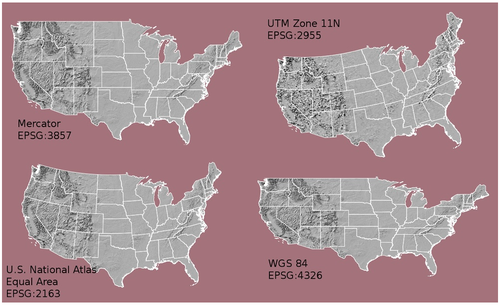
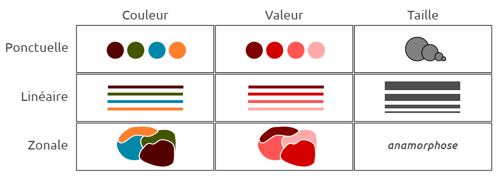
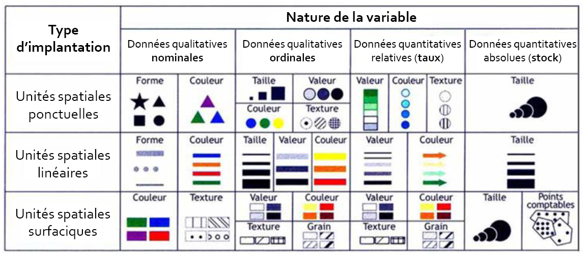
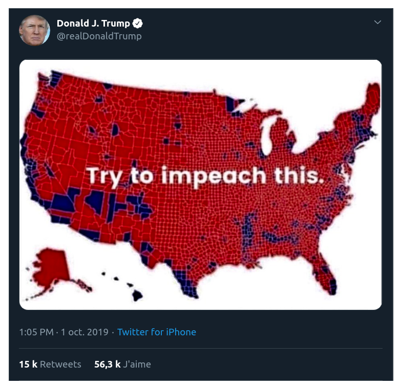
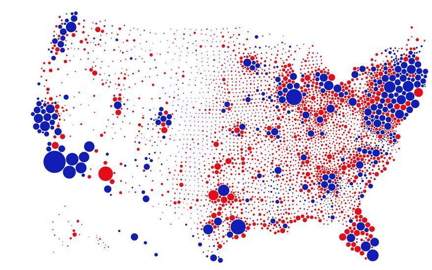
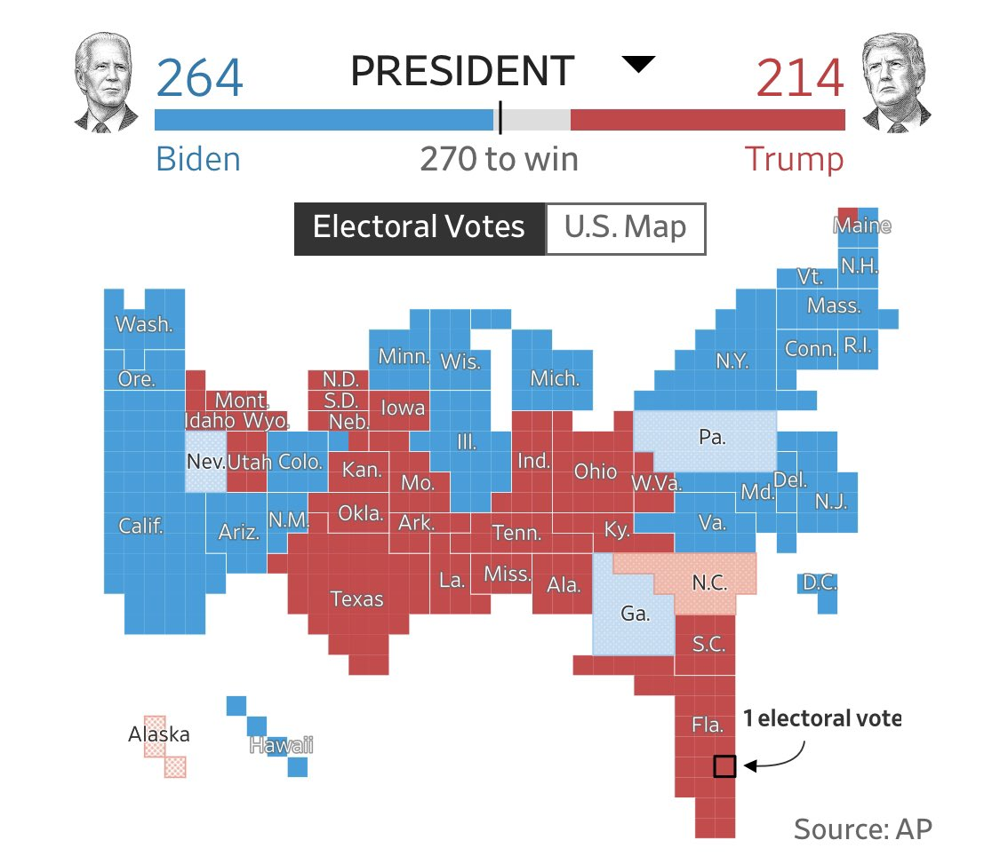
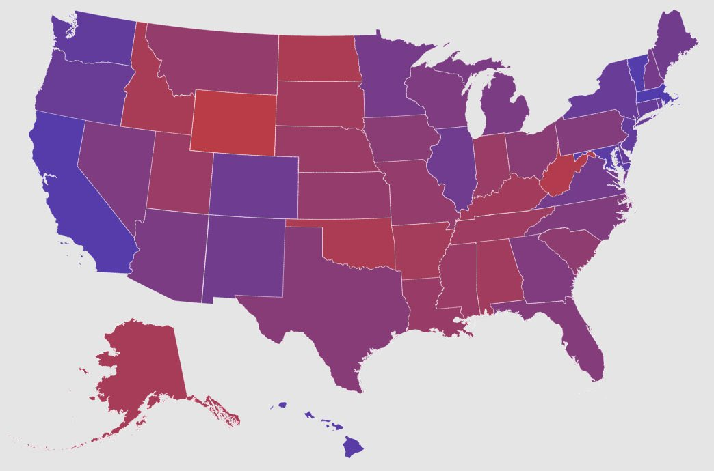
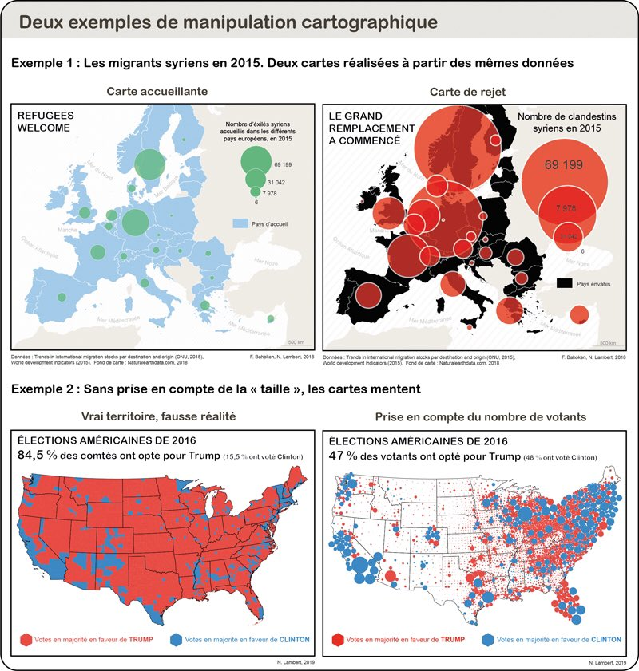
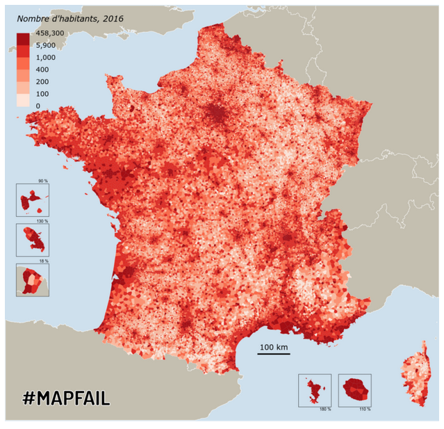
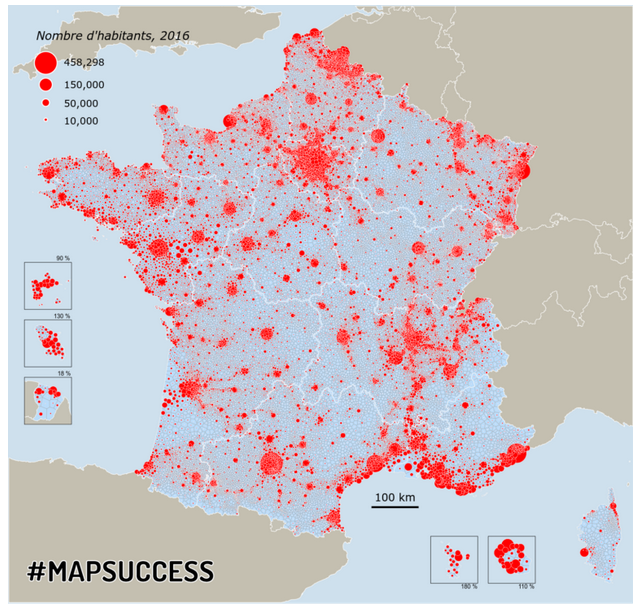

class: inverse, center, middle

# Bilan

```{r setup, include=FALSE}
  library(knitr)

# knitr::opts_chunk$set(fig.path="c://Users/jmigozzi/Dropbox/ENS/Cours/FormationR/MappingwithR/img/")
# setwd("C:/Users/jmigozzi/Dropbox/ENS/Cours/FormationR/MappingwithR/")
# options(htmltools.dir.version = FALSE)
# knitr::opts_chunk$set(fig.retina=2)
#knitr::opts_chunk$set(cache = F)
# 

# library(Cairo)
# library(cairoDevice)
# load("my_work_space.RData")
library(tidyverse)
library(kableExtra)
library(sf)
library(spData)
library(tmap)
library(cartography)
library(viridis)
library(ggthemes)
library(hrbrthemes)
library(tmap)
library(mapview)

idf_sf <- st_read(dsn = "data/idf_data/parispc_com.shp", 
                  stringsAsFactors = F)

movies <- st_read(dsn = "data/lieux-de-tournage-a-paris/lieux-de-tournage-a-paris.shp", stringsAsFactors = F)


```


---
class: inverse, center, middle

# Manipuler des données spatiales

### Jointures et opérations géométriques


---
## Les jointures

- On distingue deux grands types de jointures : 
  - Les jointures par attribut : On utilise un champ commun (un identifiant) aux deux tables.
  - Les jointures par localisation / jointures spatiales : les entités sont associées selon leurs relations géométriques.
  

---
### Jointures attributaires


- Associer données géométriques (lignes, points, polygones) à des données tabulaires
- Nécessité d'un identifiant commun ; 
- Possibilité d'utiliser les verbes du tidyverse :`left_join`, `inner_join` etc.

---
# Exercice

<br><br><br>

.center[A partir des données postées sur Slack, proposez une visualisation interactive du pourcentage de cadres par communes en IDF en 2007]

---
### Jointures spatiales

- R est un petit SIG

- On peut réaliser la totalité des opérations géométriques, qui prennent en compte les formes, les distances, les localisations et les relations entre objets. Par exemple :

  - calcul de surfaces : *st_area()*
  - calcul de distance : *st_distance()*
  - création de zone tampons : *st_buffer()*
  - récupération de centroïdes : *st_centroid()*
  - intersection entre deux objets (une route et un quartier) : *st_intersect()*
  - sélection d'objets à l'intérieur/extérieur d'un autre objet : *st_within()*
  - garder la partie commune entre deux objets : *st_intersection()*
  - fusionner des géométries : *st_union()*.
  - identifier le plus proche voisin : *st_nearest_feature()*

- R mobilise des librairies partagées avec le logiciel QGIS (*GEOS - Geometry Engine – Open Source*).


---
### Les jointures spatiales

- La jointure se base sur la position et la relation spatiale des individus.

- Les unités de la couche cible récupère les données attributaires de la couche de départ selon leur intersection.

- Exemple :
  - J'ai des données spatiales d'établissements (points) ; 
  - Je veux récupérer les caractéristiques de leur quartier, commune ou région d'appartenance pour faire un modèle multi-niveau (polygones) ; 
  - J'opère une jointure spatiale entre les points et les polygones ;
  
---
### Jointure spatiale avec R


- La fonction *st_join()* : 
  - Par défaut, un left_join : ordre des objets spatiaux importe !
  - retourne le premier objet avec la table attributaire du second
  
```{r, eval = F}

new_sf <- st_join(sf1, # objet qui reçoit attributs
                  sf2) # objet qui donne attributs
```

---
# Exercice

.center[A partir des données postées sur Slack, récupérez les informations des arrondissements pour les lieux de tournage]

<br><br>

--

<br><br>

.center[Et normalement, ça ne fonctionne pas...]


---
### Message d'erreur


```{r, error=TRUE}
u <- st_join(idf_sf, movies)
```


---
class: middle, centre, inverse

# Les coordonnées géographiques 

## *Coordinate Reference System*

### Un manuel de survie face aux CRS

---
## Les coordonnées géographiques 

- La terre est ronde. On la modélise comme une sphère, soit un objet en 3 dimensions, pour créer un système géodésique qui sert de cadre de référence pour exprimer une localisation selon des coordonnées.


- On utilise deux valeurs pour localiser un point à partir d'une sphère : 
  - la **longitude** positionne d'est en ouest (x); 
  - la **latitude** positionne du nord au Sud (y). 
  - Longitude et latitude sont les coordonnées géographiques d'un point.

- Attention : les distances ne sont pas mesurées en mètre !


---
## Les coordonnées projetées 

- Une carte est un objet en deux dimensions. 
- Il faut donc passer d'une sphère à une surface plane. 
- On utilise une **projection**, c'est à dire une transition mathématique (voir cette [vidéo](https://www.youtube.com/watch?v=OUQe2a0FOnc&list=PL6-_uJ2qn-8knSkvNkxs5BJbJy5PgtchL&index=2)).
- On projette donc la sphère, ou une portion, sur une surface plane : on projette un système de coordonnée sur une surface plane, ce qui introduit une déformation des angles, des longueurs, des formes et des surfaces.
- Certaines projections sont plus adaptées si l'on souhaite conserver les surfaces, ou au contraire les distances.

---
### Les types de projections


```{r, echo = F, fig.align="center", out.width="100%"}

```


---
### Les types de projections 

 <blockquote class="twitter-tweet"><p lang="en" dir="ltr">Nice tool for teaching / learning about map projections! <a href="https://t.co/E6JwxVV8ai">https://t.co/E6JwxVV8ai</a> <a href="https://twitter.com/hashtag/gischat?src=hash&amp;ref_src=twsrc%5Etfw">#gischat</a> <a href="https://t.co/GJNMoXLkCB">pic.twitter.com/GJNMoXLkCB</a></p>&mdash; Will Geary (@wgeary) <a href="https://twitter.com/wgeary/status/1346173035942977537?ref_src=twsrc%5Etfw">January 4, 2021</a></blockquote> <script async src="https://platform.twitter.com/widgets.js" charset="utf-8"></script>  
 

---
## Le *Coordinate Reference System*

- Le choix d'un SRC ou *CRS* répond donc à une question de recherche, à un enjeu de visualisation : quel territoire est étudié/cartographié ? 

- Il faut donc choisir / vérifier le CRS lors de la collecte de données spatiales, par exemple [ici](https://epsg.io/).

- Chaque système est référencé par un code EPSG au sein d'un [large catalogue](https://spatialreference.org/ref/epsg/) :

  - France : projection Lambert - RGF93 : EPSG:2154
  - Monde : WGS84 (utilisé par système gps) : EPSG:4326
  - Google Mercator : EPSG:3857

- Le choix d'un CRS adapté est essentiel pour tout calcul prenant en compte la distance, donc les surfaces.

---
### Gérer le crs 

- se renseigner sur le crs :

```{r, message= F, include=F}
movies <- st_read(dsn = "data/lieux-de-tournage-a-paris/lieux-de-tournage-a-paris.shp", 
                  stringsAsFactors = F)
```

```{r, eval = T}
st_crs(movies)
```

---
### Reprojeter ses données


- Changer le crs (ici, projection dîte [Lambert-93, epsg:2154](https://epsg.io/2154)) :

```{r, eval = F}
movies <- st_transform(movies, crs = "2154")
```

<br><br>

.center[.content-box-red[Tout vos jeux de données doivent avoir le même CRS pour être alignés !]]

---
# Exercice

- Question : quelle époque de l'urbanisme parisien est la plus mise en image par les tournages de film ?

- Données disponibles : 
  - tournages de films ; 
  - [secteurs géographiques des logements](https://opendata.paris.fr/explore/dataset/logement-encadrement-des-loyers/information/?disjunctive.id_zone&disjunctive.nom_quartier&disjunctive.piece&disjunctive.epoque&disjunctive.meuble_txt&location=14,48.90163,2.34391&basemap=jawg.streets)
  
- Postez votre graphique sur Slack.


---
class: center, middle, inverse

# Cartographier avec R

---
## Cartographier avec R, mais surtout cartographier...

- La composante technique est importante, mais pas essentielle. 

- Visualiser des données spatiales pour explorer un jeu de données ≠ Cartographier. 
<!-- l'essentiel : la cartographie est une démarche scientifique qui repose sur des normes et méthodes précises.
Visualiser de manière brute des données spatiales relève seulement d'une démarche exploratoire pour se familiariser avec la structure et le contenu d'un jeu de données (repérer les types de variables, les éventuelles valeurs manquantes, identifier des possibilités de traitement, des opérations de recodage à effectuer). -->

- Cartographie : sémiologie graphique + discours scientifique. 

---
### Bibliographie 


- Deux références : 

  - [Manuel de cartographie](https://www.armand-colin.com/manuel-de-cartographie-principes-methodes-applications-9782200612856) ;
  - Béguin & Pumain, 2003, *La représentation des données cartographiques. Statistiques et cartograhie*, Belin. Chapitres 3 et 5. 
- [How Charts Lie: Getting Smarter About Visual Information](http://www.thefunctionalart.com/p/reviews.html), d'Alberto Cairo (University of Miami) ; 

- Des ressources en ligne pour R :

  - [Cartographie avec R](https://rcarto.github.io/carto_avec_r/) avec le package *cartography* ; 
  - le blog [RGeomatic](https://rgeomatic.hypotheses.org/), du même package, très complet ; 
  - [Chapter 8 Making maps with R](https://geocompr.robinlovelace.net/adv-map.html), en anglais, avec le package *tmap.*  
  - le package *ggplot2*, de la suite *tidyverse* est le plus populaire pour la visualisation de données. il permet de cartographier des objets SF. Voir par exemple ce [manuel en ligne](https://cengel.github.io/R-spatial/mapping.html).
  - [Le Carnet (neo)cartographique](https://neocarto.hypotheses.org/), animé par Nicolas Lambert (UMS 


---
class: inverse, center, middle

# La sémiologie graphique

---
## Sémiologie graphique

- La cartographie utilise un langage cartographique. 

- Celui-ci utilise des **variables visuelles** que l'on applique aux formes géométriques (points, lignes, polygones).

<br>

- Jacques Bertin a proposé 6 variables (*La sémiologie graphique*, 1967) : la taille, la valeur (ou la teinte) , la couleur, la forme, l'orientation et le grain.

- Comme le rappellent Lambert et Zanin, c'était à l'époque du Noir et Blanc. De manière pragmatique, 3 variables visuelles sont à retenir : *couleur*, *valeur* et *taille* 

- L'utilisation de ces variables visuelles, soit la sémiologie graphique, varie selon la nature des données, le type de variables et le message de la carte.


---
## Sémiologie graphique : 3 variables

```{r, echo = F, fig.align="center", out.width="100%"}

```
.center[.tiny[Source : H. Commenges, 2018, "Sémiologie graphique et travail de l’image", Université Paris I]]

---
## Sémiologie graphique : variables visuelles

```{r, echo = F, fig.align="center", out.width="90%"}

```
.center[.tiny[Source : Olivier Finance, 2015, "Sémiologie, Statistique et Cartographie", UPEM]]


---
### Cartographier : produire un message

```{r, eval = T, echo = F, fig.align="center", out.width="70%", out.height= "80%"}

```
.center[ Source : N. Lambert, [Make our Cartography Great Again!](https://neocarto.hypotheses.org/6569)] 

---
### Cartographier : produire un message

```{r, eval = T, echo = F, fig.align="center", out.width="70%"}

```


---
### Cartographier : produire un message

```{r, eval = T, echo = F, fig.align="center", out.width="70%"}

```

---
### Cartographier : produire un message

```{r, eval = T, echo = F, fig.align="center", out.width="70%"}

```


---
### Cartographier : manipuler ?  

```{r, eval = T, echo = F,fig.align="center", out.width="70%", out.height="70%"}

```


---
### Gérer la couleur

- le package [RColorBrewer](https://colorbrewer2.org/#type=sequential&scheme=BuGn&n=3) : palettes continue (gradient de couleur), divergente (gradient divergent, de type chaud-froid) ou qualitative (une couleur par modalité de la variable).

```{r, fig.align= "center", out.height="10%"}
library(RColorBrewer)
display.brewer.all() #affiche toutes les palettes
# display.brewer.pal(n = 8, name = 'Dark2') 
# display.brewer.pal(n = 8, name = 'Oranges')
# display.brewer.pal(n = 8, name = 'Spectral')
```

---
### Gérer la couleur


Package proposé par l'entreprise [CARTO](https://carto.com/carto-colors/) : 

```{r, fig.align="center"}
library(rcartocolor)
display_carto_all()
```


---
### Les couleurs dans R


- **Bilan technique** : appeler une palette de couleur consiste à appeler un *vecteur* composé de chaînes de caractères, qui renvoient à des codes couleurs.  

- Cette [page internet](https://github.com/EmilHvitfeldt/r-color-palettes) recense toutes les palettes et packages développés pour la couleur. 

- **Bilan scientifique** : le choix des couleurs est dicté par : 

  - le type de variable (quanti / quali) ; 
  - le message de la carte (couleur = charge symbolique + connotation culturelle) ; 
  - les qualités esthétiques (une carte doit être agréable à regarder ; distinction fond de carte / données à cartographier). 

- Selon que la variable soit **quantitative** (stock / ratio) ou **qualitative** (nominal / ordinal), différentes normes s'imposent. 


---
## Composition et habillage

Une carte comporte :  

- un titre clair et court, intégré au graphique ; 
- une légende hiérarchisée et équilibrée d'un point de vue graphique ; 
- une échelle (souhaitable)
- des sources : nom de l'auteur et origine des données (institution, date).


---
# Exercice : commentaire de cartes

Pour chaque carte postée sur Slack :  

- Retrouvez le tableau élémentaire : 
  - identifiez la (les) population(s) observée(s) ;
  - Décrivez le type de variable ;
- Commentez la composition de la carte (titre, type de variables visuelles choisies). 

- Postez vos remarques sur Slack.


---
### Les packages

- [ggplot2](https://cfss.uchicago.edu/notes/vector-maps/) :
  - conjugué à geom_sf(), permet de faire des cartes. 
  - intérêts : compatible avec le tidyverse, utilisation courante ; 
  - limites : beaucoup de code pour un rendu graphique propre ; limité au niveau de la discrétisation.

  
- [tmap](https://cran.r-project.org/web/packages/tmap/vignettes/tmap-getstarted.html) : 
  - intérêts : spécialement conçu pour la cartographie ; utilisé dans le livre [Geocomputation with R](https://geocompr.robinlovelace.net/) ; communauté d'utilisateurs en expansion ; 
  - très versatile : dans l'esprit du tidyverse (facet_wrap etc.)

  
- [cartography](https://cran.r-project.org/web/packages/cartography/vignettes/cartography.html)
  - développé par des cartographes et ingénieurs français ; 
  - de très nombreuses fonctions qui couvrent la diversité des cartes ; 
  - Riches fonctions d'habillage et mise en page (cartons) ;
  - discrétisation bien intégrée ;
  - limites : pas de logique tidyverse.

.center[A chaque package, sa carte et son public]

---
class: inverse, center, middle

# Cartographie thématique

## Avec [tmap](https://maeltheuliere.github.io/rspatial/cr%C3%A9er-des-cartes-avec-tmap.html) et [cartography](https://rcarto.github.io/carto_avec_r/)

---
## La carte typologique : cartography

.center[Elle permet de représenter une variable qualitative catégorielle ou ordinale.] 

.center[Utile pour faire une carte de localisation]


.left-code[
```{r plot-label1, eval=FALSE}


typoLayer(idf_sf,
var = "NOM_DEPT", 
col = viridis(4), 
legend.title.txt = "Département", 
legend.pos = "topleft"
) 

#Fonction pour habillage de la carte

layoutLayer(
title = "L'Ile de France", 
author = "J. Migozzi, 2020.", 
sources = "Insee, 2007"
)
```
]

.right-plot[
```{r plot-label1-out, ref.label="plot-label1", echo=FALSE}
```
]


.center[Comment cartographier ici une variable ordinale ?]

---
## La carte typologique : tmap

.center[Elle permet de représenter une variable qualitative catégorielle ou ordinale.] 


.left-code[
```{r plot-label2, eval=FALSE}
library(tmap)

# Objet 
tm_shape(idf_sf) +
  
# Formes géométriques
 tm_polygons("NOM_DEPT", 
             title = "", 
             palette = viridis(4)) +
  
# Mise en page
 tm_layout("Les départements en IDF",
          legend.title.size = 1.5,
          legend.text.size = 1,
          title.position = c("center", "top"),
          legend.position = c("left","bottom"),
          legend.bg.color = "white",
          legend.bg.alpha = 1) +
  
# Sources
  tm_credits("J. Migozzi, 2021. Source: Insee", 
           position=c("left", "bottom"))


```
]

.right-plot[
```{r plot-label2-out, ref.label="plot-label2", echo=FALSE}
```
]

---
## La carte de symboles proportionnels : cartography

.center[.content-red-box[On ne représente JAMAIS un stock avec un aplat de couleur]]

<br>

.pull-left[
```{r, eval = T, echo = F,fig.align="center", out.width="100%"}

```
]

.pull-right[
```{r, eval = T, echo = F,fig.align="center", out.width="100%"}


```
]

.center[.tiny[N. Lambert, [Carnet Neocartographique](https://neocarto.hypotheses.org/5717)]]

---
## La carte de symboles proportionnels : cartography

.center[.content-red-box[On ne représente JAMAIS un stock avec un aplat de couleur]]

.left-code[
```{r plot-label3, eval=FALSE}

#fond de carte

plot(st_geometry(idf_sf), 
     col="ivory", #couleur
     border = "ivory3") #bordures

#Fonction
propSymbolsLayer(idf_sf, 
  var = "POPULATION", #nom de la variable 
  legend.pos = "topleft", #position de la légende
  inches = 0.1, #taille du plus gros symbole
  legend.style = "e", #légende "étendue"
  legend.title.txt = "Population en milliers", #titre de la légende
  add = T) #ajouter au fond de carte

# Mise en page
layoutLayer(title = "Population en Ile de France", 
    author = "Auteur: J. Migozzi",
    sources = "Source : R et Espace, 2018",
    tabtitle = T,
    frame = TRUE, 
    scale = NULL)
```
]


.right-plot[
```{r plot-label3-out, ref.label="plot-label3", echo=FALSE}
```
]

---
## La carte de symboles proportionnels : tmap


.left-code[
```{r plot-label4, eval=FALSE}

tm_shape(idf_sf) +
  tm_polygons(col = "ivory") +
  tm_bubbles("POPULATION", 
             col = "red", 
             scale = 3) +
tm_credits("J. Migozzi, 2021. Source: Insee", 
           position=c("left", "bottom"))

```
]

.right-plot[
```{r plot-label4-out, ref.label="plot-label4", echo=FALSE}
```
]

---
## Le fond de carte

Travailler dans R permet d'appeler des fichiers raster pour obtenir des fonds de carte auprès de divers fournisseurs : OpenStreetMap, CartoDB, Esri etc. 

Il peut s'agir de cartes, de photographies aériennes, dont on choisit la résolution (la finesse). 

---
## Le fond de carte

Le package *cartography* propose une [fonction](https://www.rdocumentation.org/packages/cartography/versions/2.4.2/topics/getTiles) pour cela. 

```{r, echo = T, warning=F}
paris <- idf_sf %>% filter(NOM_DEPT == "PARIS")
#Télécharger un fond de carte avec la fonction getTiles
parisOSM <- getTiles(x = paris,
                   type = "CartoDB.Positron", 
                   crop = TRUE)
```

Le package tmap propose la fonction *tm_basemap*, d'une logique similaire.

---
## Le fond de carte

```{r, echo = T, warning=F, fig.align="center"}
tilesLayer(parisOSM)
```


---
# Exercice

- Avec le package de votre choix, réalisez deux cartes à l'échelle de la commune en IDF : 

 - le nombre d'ouvriers en 2007 ; 
 - le nombre de cadres en 2007.
 
- Postez vos cartes sur Slack


---
class: center, middle, inverse

# La discrétisation 

## Cartographier une variable quantitative relative

### Next week


---
class: center, middle

# Merci !

Slides crées avec le package [**xaringan**](https://github.com/yihui/xaringan).


