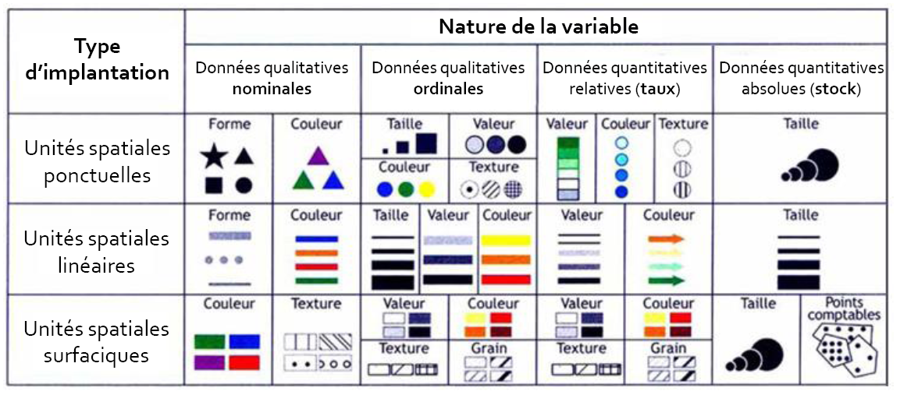

class: inverse, center, middle

# Bilan


```{r setup, include=FALSE}
  library(knitr)

# knitr::opts_chunk$set(fig.path="c://Users/jmigozzi/Dropbox/ENS/Cours/FormationR/MappingwithR/img/")
# setwd("C:/Users/jmigozzi/Dropbox/ENS/Cours/FormationR/MappingwithR/")
# options(htmltools.dir.version = FALSE)
# knitr::opts_chunk$set(fig.retina=2)
#knitr::opts_chunk$set(cache = F)
# 

# library(Cairo)
# library(cairoDevice)
# load("my_work_space.RData")
library(tidyverse)
library(kableExtra)
library(sf)
library(spData)
library(tmap)
library(cartography)
library(viridis)
library(ggthemes)
library(hrbrthemes)
library(tmap)
library(mapview)
library(RColorBrewer)
library(NineteenEightyR)

idf_sf <- st_read(dsn = "data/idf_data/parispc_com.shp", 
                  stringsAsFactors = F)

soc_eco <- read.csv("data/idf_data/paris_soc_eco.csv")
soc_eco$INSEE_COM <- as.character(soc_eco$CODGEO)

idf_sf <- left_join(idf_sf, #objet 1 : l'objet sf
                    soc_eco, #objet 2 : le data.frame
                    by = "INSEE_COM") # l'identifiant commun

movies <- st_read(dsn = "data/lieux-de-tournage-a-paris/lieux-de-tournage-a-paris.shp", stringsAsFactors = F)


```
---
### Solutions


.left-code[
```{r,  plot-labelS1, eval=FALSE, fig.align="center"}


idf_sf <- idf_sf %>% 
  mutate(pop_cad = PCAD07*ACTOCC06/100,
         pop_ouv = POUV07*ACTOCC06/100)

tm_shape(idf_sf) +
  #Fond de carte
  tm_polygons('NOM_DEPT', 
              palette=sunset3(4),
              title="Département") +
  #Symbole
  tm_squares(c('pop_cad','pop_ouv'),
             scale=1.5,
             title.size="Effectifs",
             col="#E6EBF9") +
  # échelle commune
  tm_facets(ncol=2,free.scales = F) +
  #Légende
  tm_layout(main.title = "Cadres et ouvriers en IDF (2007)",
            main.title.size = 1.2,
            legend.outside = T,
            main.title.position = "left",
            legend.outside.position =  "bottom", 
            legend.position = c(0.25, 0.5),
            panel.labels = c('Cadres', 'Ouvriers'),
            panel.label.color = "grey98",
            panel.label.bg.color = "#6B7182", 
            legend.stack = "H") +
  tm_credits(c('Source: Insee','Source: Insee'), 
             size = 0.6,
             position=c('left', 'bottom'))


```
]


.right-plot[
```{r plot-labelS1-out, ref.label="plot-labelS1", echo=FALSE, fig.align="center"}
```
]


---
## Sémiologie graphique : variables visuelles

```{r, echo = F, fig.align="center", out.width="90%"}

```
.center[.tiny[Source : Olivier Finance, 2015, "Sémiologie, Statistique et Cartographie", UPEM]]

<br>

L'étude et la représentation d'une donnée quantitative, en taux ou en stock, nécessite une démarche statistique où l'enjeu de *visualisation* est primordial. 


---
### La carte chroroplèthe

- Le type le plus commun, très populaire pour représenter la pandémie actuelle.


```{r, echo = F, fig.align="center", out.width="70%"}

```
.center[.tiny[Source : data.gouv.fr]]


- Représenter une quantité relative à un espace, une aire. 


---
class: center, middle, inverse

# La discrétisation

---
## La discrétisation : principe


.blockquote[Perdre le moins possible d’information, du point de vue de la statistique, reviendrait à cartographier toutes les valeurs (…). Or, nous savons que les règles de la perception visuelle contredisent cette exigence, la lisibilité (…) étant d’autant plus grande que le nombre de signes distincts, donc de classes, est petit.
.right[Béguin et Pumain, 1994]]

<!-- <blockquote> -->
<!-- "Perdre le moins possible d’information, du point de vue de la statistique, reviendrait à cartographier toutes les valeurs (…). Or, nous savons que les règles de la perception visuelle contredisent cette exigence, la lisibilité (…) étant d’autant plus grande que le nombre de signes distincts, donc de classes, est petit." -->
<!-- .right[-- <cite>Béguin et Pumain, 1994</cite>] -->
<!-- </blockquote> -->


Il faut donc rendre **les caractères continus discrets** : on parle de discrétisation.

On divise donc la série en classe : on passe d'une **variable quantitative continue** à une **variable qualitative ordonnée**.

C'est un problème mathématique et graphique. 


---
### Discrétiser : un compromis


- Résumer au mieux la distribution (conserver l’hétérogénéité des unités) = *le plus grand nombre de classes*.

<br>

- Construire une carte efficace (synthétiser l'information) = *un faible nombre de classes*.

<br>

- Restituer la forme de la distribution statistique = créer des classes homogènes et distinctes. 
  

---
### Discrétiser : enjeux

.center[Il faut donc chercher à préserver :]

<br>

- l’ordre de grandeur : regarder les valeurs centrales (moyenne, médiane), qui peuvent être utilisées comme limite de classe
  - *telle unité spatiale est au dessus / en dessous de la médiane*.

- la dispersion : regarder l'écart-type, l'IQR, le coefficient de variation. On peut choisir ces valeurs comme amplitude des classes : 
  - *ces unités spatiales sont 2 écart-types au dessus de la moyenne.*
  
- la forme de la distribution : normal, symétrique ou dissymétrique.

- Décider de conserver ou non les singularités : mettre en valeur les unités spatiales aux valeurs exceptionnelles.
  
---
## Les méthodes de discrétisation 

- Il faut d'abord étudier la distribution de la variable : 
      - avec un histogramme ; 
      - avec un [boxplot](https://juba.github.io/tidyverse/08-ggplot2.html#geom_boxplot) ;
      - avec une [courbe de distribution](https://juba.github.io/tidyverse/08-ggplot2.html#geom_density)

- Puis choisir une méthode adaptée. Des références : 

  - Lambert et Zanin, 2019, [Manuel de cartographie](https://www.armand-colin.com/manuel-de-cartographie-principes-methodes-applications-9782200612856), Armand Colin ;
  
  - "Chapitre 5 : Découper en classes les séries quantitatives", Béguin & Pumain, 2003, *La représentation des données cartographiques. Statistiques et cartographie*, Belin. 
  


---
### La discrétisation sur R

- Discrétiser consiste à : 
  - découper un vecteur de valeurs numériques...
  - ... pour obtenir un plus petit vecteur...
  - ... que l'on va associer à une palette de couleurs.

<br>

- Il faut donc deux vecteurs : 
  - un vecteur numérique avec des bornes ; 
  - un vecteur de couleur, d'une longeur équivalenye. 

<br>

- Les packages *cartography* et *tmap* comportent des fonctions natives.

- Le principe est le même : 
  - désigner une méthode déjà incluse en spécifiant le nombre de classes ; 
  - appeler une palette de couleur ;
  - ou faire ces deux opérations "manuellement".

---
### Cartography : carte choroplèthe


.pull-left[
```{r, echo = T, fig.align="center", out.width="100%"}
tm_shape(idf_sf) +
  tm_polygons("TXCHOMA07")

```
]


.pull-right[
```{r, echo = T, fig.align="center", out.width="100%"}
choroLayer(idf_sf, 
           var = "TXCHOMA07")

```
]


---
### Discrétiser

la fonction *getBreaks()* du package *cartography* renvoie le vecteur produit par la méthode de discrétisation mentionnée.

```{r, echo = T, fig.align="center", out.height="40%"}
bks <- getBreaks(idf_sf$TXCHOMA07,
                 method= "quantile",
                 nclass = 4)
bks
```

---
class: middle, center, inverse

# Les méthodes de discrétisation 

---
### Seuils naturels : tmap

Les bornes sont crées par observation de la distribution : repérer, à l'oeil, des ruptures ou des seuils naturels.

On ne peut pas utiliser une telle méthode pour comparer des variables. 

.left-code[
```{r,  plot-labelA, eval=FALSE, fig.align="center"}

tm_shape(idf_sf) + 
  
tm_polygons(col = "TXCHOMA07", 
  title = "Taux de chômage",
  style = "fixed", 
  breaks = c(6, 10, 15, 30), 
  labels = c("De 6 à 9", "de 10 à 14", "de 15 à 30"), 
  legend.hist = T,
  legend.reverse = F) +

tm_layout(legend.outside = TRUE,
  legend.outside.position = "right",
  legend.position = c(0.1, 0.25),
  
  main.title = "Le chômage en IDF",
  legend.title.size = 2,
  main.title.position = "centre",
  
  legend.hist.width = .5,
  
  frame = F
              )

```
]

.right-plot[
```{r plot-labelA-out, ref.label="plot-labelA", echo=FALSE, fig.align="center"}
```
]


---
### Seuils naturels : cartography


.left-code[
```{r,  plot-labelB, eval=FALSE, fig.align="center"}


choroLayer(idf_sf, var = "TXCHOMA07", 
           breaks = c(6, 10, 15, 30), 
           legend.pos = "topleft", 
           legend.title.cex = 1.2,
           col = viridis(3),
           legend.values.cex = 0.9,
           legend.title.txt = "Taux")

layoutLayer(title = "Le chômage en IDF", 
    author = "Auteur: J. Migozzi",
    sources = "Source : INSEE, 2007", 
     tabtitle = T, 
    frame = TRUE, scale = NULL)

```
]


.right-plot[
```{r plot-labelB-out, ref.label="plot-labelB", echo=FALSE, fig.align="center"}
```
]

---

### Amplitude égale : tmap

Les bornes sont crées par observation de la distribution : repérer, à l'oeil, des ruptures ou des seuils naturels.

Adaptée pour des cartes uniques. 

Mais : on ne peut pas utiliser une telle méthode pour comparer des variables. 

.left-code[
```{r,  plot-labelT2, eval=FALSE, fig.align="center"}

tm_shape(idf_sf) + 
  
tm_polygons(col = "TXCHOMA07", 
  title = "Taux de chômage",
  palette = viridis(4),
  style = "equal", 
  legend.hist = T) +

tm_layout(legend.outside = TRUE,
  legend.outside.position = "right",
  legend.position = c(0.1, 0.25),
  
  main.title = "Le chômage en IDF",
  legend.title.size = 2,
  main.title.position = "centre",
  
  legend.hist.width = .5,
  
  frame = F
              )

```
]

.right-plot[
```{r plot-labelT2-out, ref.label="plot-labelT2", echo=FALSE, fig.align="center"}
```
]


---
### Amplitude égale

Les classes possèdent la même amplitude. 

Forme de distribution : uniforme, symétrique.

.left-code[
```{r,  plot-label2, eval=FALSE, fig.align="center"}
choroLayer(idf_sf, 
  var = "TXCHOMA07",
  nclass = 4,
  method = "equal",
  legend.pos = "topleft", 
  legend.title.cex = 1.2,
  col = viridis(4),
  legend.values.cex = 0.8,
  legend.title.txt = "Taux") 

layoutLayer("Le chômage en IDF", 
    author = "Auteur: J. Migozzi",
    sources = "Source : INSEE, 2007", 
    tabtitle = T, 
    frame = TRUE, 
    scale = NULL)

```
]

.right-plot[
```{r plot-label2-out, ref.label="plot-label2", echo=FALSE, fig.align="center"}
```
]

---
### Effectifs égaux (quantiles)


La méthode des effectifs égaux est appropriée lorsque la distribution est asymétrique.

Elle permet de comparer plusieurs variables. 

Ici, les bornes sont construites en 4 classes d’effectifs égaux : des quartiles. 

.left-code[
```{r,  plot-labelT3, eval=FALSE, fig.align="center"}

k <- 4

tm_shape(idf_sf) + 
  
tm_polygons(col = "TXCHOMA07", 
  title = "Taux de chômage",
  palette = viridis(k),
  style = "quantile", 
  n = k,
  legend.hist = T) +

tm_layout(legend.outside = TRUE,
  legend.outside.position = "right",
  legend.position = c(0.1, 0.25),
  
  main.title = "Le chômage en IDF",
  legend.title.size = 2,
  main.title.position = "centre",
  
  legend.hist.width = .5,
  
  frame = F
              )

```
]

.right-plot[
```{r plot-labelT3-out, ref.label="plot-labelT3", echo=FALSE, fig.align="center"}
```
]

---
### Effectifs égaux (quantiles) : cartography


.left-code[
```{r,  plot-labelC1, eval=FALSE, fig.align="center"}
choroLayer(idf_sf, var = "TXCHOMA07",
           method = "quantile", 
           nclass = 4, 
           legend.pos = "topleft", 
           legend.title.cex = 2,
           col = viridis(4),
           legend.values.cex = 1.1,
           legend.title.txt = "Taux")
layoutLayer(title = "Le chômage en IDF", 
    author = "Auteur: J. Migozzi",
    sources = "Source : INSEE, 2007", 
     tabtitle = T, 
    frame = TRUE, scale = NULL)

```
]

.right-plot[
```{r plot-labelC1-out, ref.label="plot-labelC1", echo=FALSE, fig.align="center"}
```
]


---
### Effectifs égaux (déciles)

.left-code[
```{r,  plot-labelT4, eval=FALSE, fig.align="center"}

k <- 10

tm_shape(idf_sf) + 
  
tm_polygons(col = "TXCHOMA07", 
  title = "Taux de chômage",
  palette = viridis(k),
  style = "quantile", 
  n = k,
  legend.hist = T) +

tm_layout(legend.outside = TRUE,
  legend.outside.position = "right",
  legend.position = c(0.1, 0.25),
  
  main.title = "Le chômage en IDF",
  legend.title.size = 2,
  main.title.position = "centre",
  
  legend.hist.width = .5,
  
  frame = F
              )

```
]

.right-plot[
```{r plot-labelT4-out, ref.label="plot-labelT4", echo=FALSE, fig.align="center"}
```
]


---
### Effectifs égaux (déciles)


.left-code[
```{r,  plot-labelC2, eval=FALSE, fig.align="center"}
choroLayer(idf_sf, var = "TXCHOMA07",
           method = "quantile", 
           nclass = 10, 
           legend.pos = "topleft", 
           legend.title.cex = 2,
           col = viridis(10),
           legend.values.cex = 1.1,
           legend.title.txt = "Taux")
  layoutLayer(title = "Le chômage en IDF", 
    author = "Auteur: J. Migozzi",
    sources = "Source : INSEE, 2007", 
     tabtitle = T, 
    frame = TRUE, scale = NULL)

```
]

.right-plot[
```{r plot-labelC2-out, ref.label="plot-labelC2", echo=FALSE, fig.align="center"}
```
]


---
### Moyenne et écart-type

Les classes sont déterminées selon une fraction d’écart-type par rapport à la moyenne. 

Cette méthode est valide lorsque la distribution est symétrique. 

La palette divergente est recommandée.


.left-code[
```{r,  plot-labelT5, eval=FALSE, fig.align="center"}

k <- 4

tm_shape(idf_sf) + 
  
tm_polygons(col = "TXCHOMA07", 
  title = "Taux de chômage",
  palette = viridis(k),
  style = "sd", 
  n = k,
  legend.hist = T) +

tm_layout(legend.outside = TRUE,
  legend.outside.position = "right",
  legend.position = c(0.1, 0.25),
  
  main.title = "Le chômage en IDF",
  legend.title.size = 2,
  main.title.position = "centre",
  
  legend.hist.width = .5,
  
  frame = F
              )

```
]

.right-plot[
```{r plot-labelT5-out, ref.label="plot-labelT5", echo=FALSE, fig.align="center"}
```
]


---
### Moyenne et écart-type


.left-code[
```{r,  plot-labelC3, eval=FALSE, fig.align="center"}
choroLayer(idf_sf, var = "TXCHOMA07", 
           method = "sd",
           nclass = 4,
          col = viridis(5),
           legend.pos = "topleft", 
           legend.title.cex = 1.2,
           legend.values.cex = 0.8,
           legend.title.txt = "Taux")
layoutLayer(title = "Le chômage en IDF", 
    author = "Auteur: J. Migozzi",
    sources = "Source : INSEE, 2007", 
     tabtitle = T, 
    frame = TRUE, scale = NULL)

```
]

.right-plot[
```{r plot-labelC3-out, ref.label="plot-labelC3", echo=FALSE, fig.align="center"}
```
]


---
### Jenks

Maximise la variance inter-classe et minimise la variance intra-classe. 

Méthode utile  pour dégager des groupes cohérents, mais ne permets pas la comparaison. 

```{r, echo = F, warning=F, fig.align="center"}
choroLayer(idf_sf, var = "TXCHOMA07", 
           method = "fisher-jenks",
           nclass = 4,
          col = viridis(4),
           legend.pos = "topleft", 
           legend.title.cex = 2,
           legend.values.cex = 1.2,
           legend.title.txt = "Taux")
layoutLayer(title = "Le chômage en IDF", 
    author = "Auteur: J. Migozzi",
    sources = "Source : R et Espace, 2018", 
     tabtitle = T, 
    frame = TRUE, scale = NULL)

```


---
### Discrétisation et comparaison 


- Pour comparer les positions des mêmes unités selon plusieurs variables : il faut employer une méthode permettant d’utiliser les mêmes paramètres statistiques de chaque série (par exemple la moyenne et l’écart-type) ;

- Pour comparer les dispersions de plusieurs variables avec les mêmes unités : 
  - cette comparaison n’est valable que si les données sont de même nature avec les unités de mesure identiques 
  - la méthode des amplitudes ou effectifs égaux avec palette graduée.

- Pour comparer une même série à des dates différentes : il faut établir la discrétisation sur l’ensemble des valeurs observées pour l’ensemble des dates.

.center[.tiny[Source : Hypergéo, [Discrétisation](https://www.hypergeo.eu/spip.php?article374)]]

---
### Conclusion 

- La discrétisation détermine l'apparence et le message de la carte ; 

- Toute carte doit préciser en légende la [méthode de discrétisation retenue](https://geocompr.github.io/post/2019/tmap-color-scales/) ; 

- La discrétisation doit permettre de renseigner sur la position d'une unité spatiale par rapport à la distribution de la variable. 

- Une bonne pratique consiste à associer à la carte un histogramme.

---
### Exercice 

A. Cartographier ces deux CSP en justifiant la méthode de discrétisation utilisée et la palette de couleur employée. Commentez et comparer brièvement les deux cartes. 

B. Commenter la distribution statistique du revenu médian en justifiant la méthode de discrétisation choisie, puis cartographiez là. 

C. Cartographier  et Commentez la distribution des intérimaires en 1999 et 2007.

D. La méthode Q6 permet d'effectuer une discrétisation selon la méthode des quartiles tout en isolant les valeurs extrêmes. Les 6 classes sont définies avec les bornes suivantes : minimum,  percentile  5,  1er  quartile,  médiane,  3e  quartile,  percentile  95,  maximum.  Cette discrétisation permet de séparer 5% des unités spatiales ayant les valeurs les plus petites, et 5% les plus grandes. Réalisez une carte en discrétisation Q6 avec tmap.

---
class: center, middle

# Merci !

Slides crées avec le package [**xaringan**](https://github.com/yihui/xaringan).


